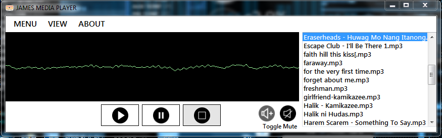

<h1>

James-Media-Player

</h1>

## **ABOUT** ##
##### This is just a simple MP3 Player created using Visual Studio 2013 and **[WMP](https://www.microsoft.com/en-ph/download/windows-media-player-details.aspx)** plugin. Via the source code it shows MP4 player and that is the initial plan but I do realize that I need an MP3 player and not MP4 (`lol hahaha` ) here is the  **[SOURCE CODE](https://github.com/rockstartraders/James-Media-Player/tree/master/James%20MP4%20Player)**.

## **Enhacement** ##
##### I may need to add a timer to serve as a function for new `SelectedIndex` to go to the next list presnt via `listBox`. 
##### `Slider` can also be added for UI purposes.

## **DOWNLOAD**
##### `git clone https://github.com/rockstartraders/James-Media-Player.git`
##### then `unzip` the path for the .exe build is loacted at `James MP4 Player/ -> James MP4 Player/ -> bin/Debug/ -> James MP4 Player.exe`.

## **Screenshot**

  

